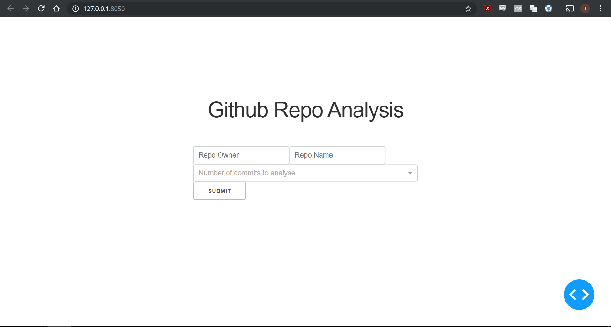
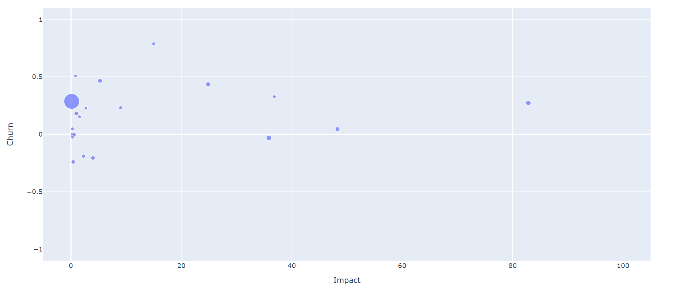

# SWENG GitHub Data Visualisation

The home page is below where you can specify a repository to analyse.

Click image below for video demonstration.

This app analyses repositories and compares impact of commits and churn of commtis (naively).

Sophisticated tools are generally used to analyse these metrics but I feel this is a good general indicator.

Here is a an example of a generated graph:

 

Each point is a user who has committed to the repository. 20 is the default number of committers to analyse.

 - Top Left: High Churn, Low Impact = Potentially struggling
 - Top Right: High Churn, High Impact = Exploring new solutions
 - Bottom Left: Low Churn, Low Impact = Perfectionism
 - Bottom Right: Low Churn, High Impact = Prolific
 
Many Github libraries offer quick access to the Committers of a repository but the committer and the author of a commit are often different users. Author seemed more useful as it was the user who actually wrote the code rather than just ok'd the merge.

This meant I had to manually process the data to get the authors which increased the load times.

# To run

Create a github token and insert it into git_token.

## Requirements
I used dash and plotly for the graphs and PyGithub as the Github API library

    pip install plotly==4.3.0
    pip install dash==1.6.1
    pip install PyGithub
    pip install pandas

Operator was also used
